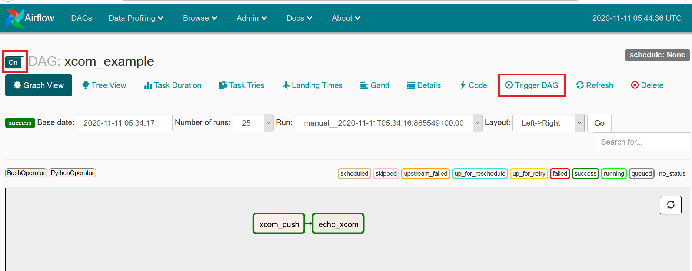

# AIRFLOW XCOM EXAMPLE

## Introdução
Este projeto tem como objetivo testar a comunicação entre tasks no Apache Airflow ([xcom](https://airflow.apache.org/docs/stable/concepts.html?highlight=xcom))

## Pré-requisitos:
* [docker](https://www.docker.com/products/docker-desktop)

## Construção do ambiente através do docker compose:
   - No terminal, Execute o seguinte comando:
```
cd airflow-xcom-example/
docker-compose up
```   
## Execução do pipeline:
   - Após a criação do ambiente, acesse o navegador através do endereço http://localhost:8080, ative o pipeline (ON) e clique no botão Trigger DAG:
